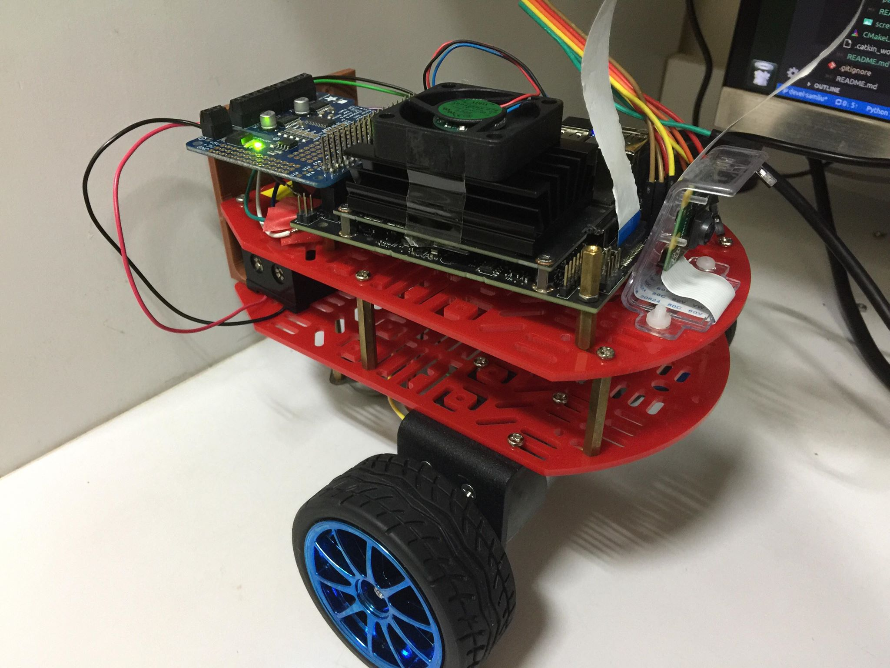

# 04-trail-following-robot
This section if prepare for the implementation of **Deep trail-following** on SuperDuckiebot.
ARG summer interns will help complete this section included instruction, hardware and software part.

## Before we get stared
Check for the following prerequisites:
- Nvidia Jetson Nano (Jetpack 4.2)
- Pi camera v2
- Adafruit motor HAT with two DC motors
- Git clone summer intern repository

```bash
    cd at-summer-intern2019/04-trail-following-robot/catkin_ws
    catkin_make
```

## I. How to run
```bash
    at-summer-intern2019/04-trail-following-robot/catkin_ws
    source devel/setup.sh
```

Joystick control
```bash
    roslaunch jetbot_ros joystick.launch
```
Camera senosor
```bash
    roslaunch video_stream_opencv camera.launch
```

## II. Hardware



## III. Software
We took [Jetbot repo](https://github.com/dusty-nv/jetbot_ros) [video_stream_opencv](http://wiki.ros.org/video_stream_opencv) and as references and modify the code to match our robot purpose, such as the issue for a Jetson Nano to drive a pi camera.

## IV. Result


## Trouble shooting